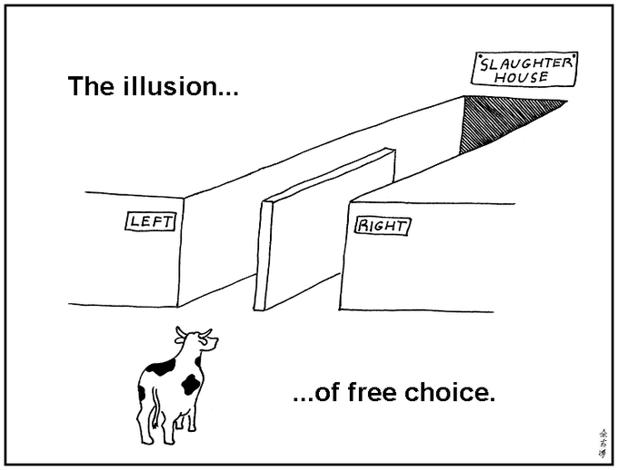
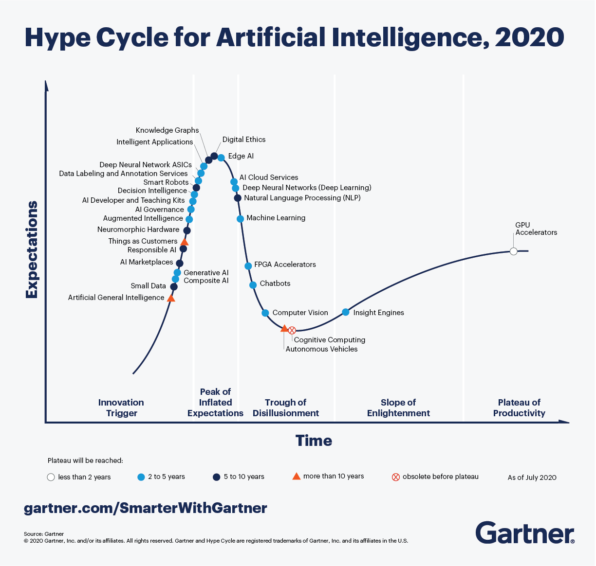
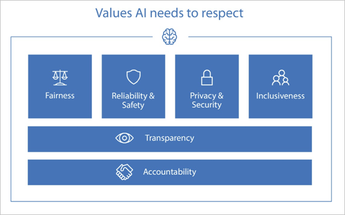

# Introduction to Data Ethics

It will become far easier to integrate data-driven and algorithm-driven automation but we need to recognize the potential harms caused by the weaponization of these at large scale.

Data scientists will also get unprecedented access to personal data. This also gives data scientists unprecedented power which could influence decision making creating an illusion of free choice (graphic from abstruse goose) 

Thus, the point is __data ethics are now necessary guardrails for data science and engineering__ There is even this very helpful _Gartner Hype Cycle for AI_ to get an idea of trends in digital ethics around the implementation of AI into democracy and industry.

## Definitions
Ethics - shared values and moral principles that govern our behaviour in society, based on the common beliefs of "right" and "wrong"
Data Ethics - ethics but related to data, algorithms, and corresponding practices
Applied Ethics - applying ethics to real-world actions, products and processes
Ethics Culture - making sure applied ethics works across teh entire organization

## Concepts

#### Ethics Principles
"shared values" that describe what is ethical, for individual and team levels.
Most large organizations have an _ethical AI_ mission statement

Ex. Microsoft
"We are committed to the advancement of AI-driven by ethical principles that put people first"
  
__Think about what your data ethics mission statement could be. Looking at other organizations, what shared values do they have in common? How do these principles relate to the AI product or industry they operate in?
Examples given are IBM, Google, Facebook, and Microsoft__
